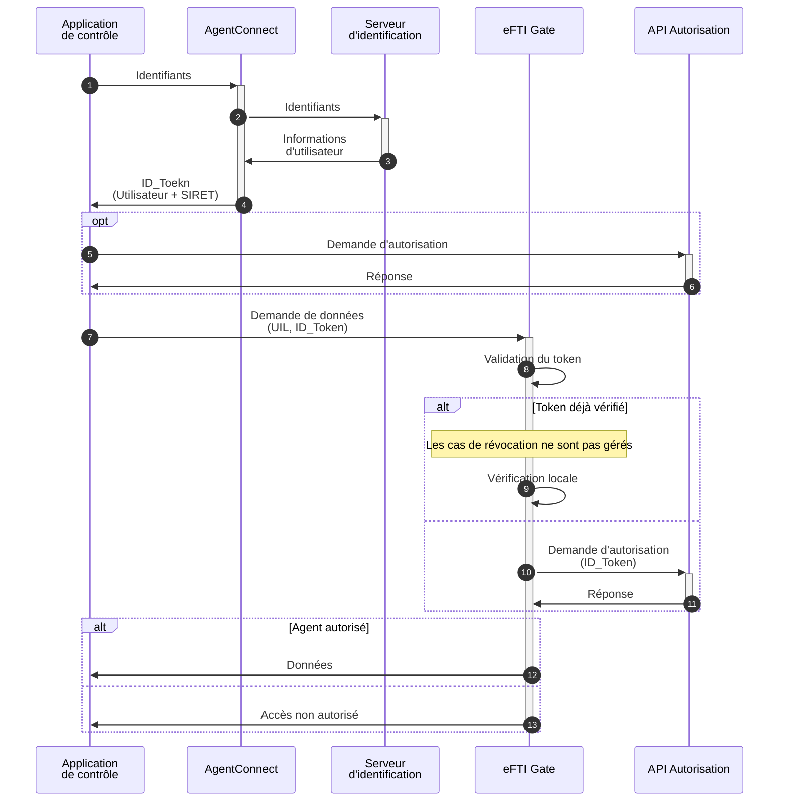

## Documentation

Documentation can be found online at <https://apple.github.io/foundationdb/>. The documentation covers details of API usage, background information on design philosophy, and extensive usage examples. Docs are built from the [source in this repo](documentation/sphinx/source).

## Forums

[The FoundationDB Forums](https://forums.foundationdb.org/) are the home for most of the discussion and communication about the FoundationDB project. We welcome your participation!  We want FoundationDB to be a great project to be a part of and, as part of that, have established a [Code of Conduct](CODE_OF_CONDUCT.md) to establish what constitutes permissible modes of interaction.

## Contributing

Contributing to FoundationDB can be in contributions to the code base, sharing your experience and insights in the community on the Forums, or contributing to projects that make use of FoundationDB. Please see the [contributing guide](CONTRIBUTING.md) for more specifics.

## Getting Started

### Binary downloads

Developers interested in using FoundationDB can get started by downloading and installing a binary package. Please see the [downloads page](https://github.com/apple/foundationdb/releases) for a list of available packages.

